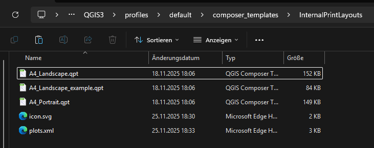
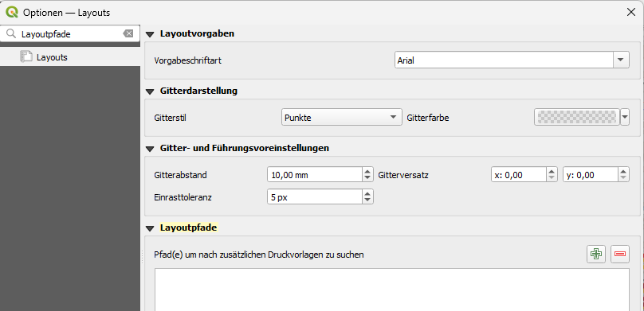

<!--
SPDX-FileCopyrightText: 2025 Deutsche Telekom Technik GmbH <f.vonstudsinske@telekom.de>

SPDX-License-Identifier: GPL-3.0-only
-->

# QGIS Plot Plugin

### <mark>Diese Dokumentation stellt keine Schulungsunterlage für das Druckplugin oder QGIS dar!</mark>

Die Dokumentation ist primär in Deutsch formuliert, da die hiermit arbeitende Zielgruppe deutschsprachig ist (Entwickler sowie Fachseite/Nutzer).

## Eigene Druckvorlagen

Neben den Standardvorlagen können eigene Druckvorlagen verwendet werden. Eigene Druckvorlagen müssen mit dem erwartetenen Format der Layoutgestaltung (Elementkennungen, Elementtypen etc.) übereinstimmen.
Ein stark vereinfachtes Beispiel ist in `templates/plots/public` zufinden, wo die Abhängigkeiten minimal dargestellt werden.

### Vorlagenordner

Ein Vorlagen-Ordner ist grundsätzlich wie folgt strukturiert:

- Vorlagenordner
    - plots.xml (zwingend erforderlich für das Vorlagenverzeichnis)
    - Vorlagen (*.qpt)
    - Bilder
    - usw. 

Der Name eins Vorlagenordners sollte während der gesamten Nutzung immer eindeutig und nicht mehrfach in Benutzung sein.
Ein Vorlagenordner wird erkannt, wenn darin eine `plots.xml`-Datei liegt.

### Vorlagen im QGIS-Benutzerprofil

In dem Ordner `composer_templates`, im aktuellen Benutzerprofil, können individuelle Vorlagen abgelegt werden.
Sowohl QGIS als auch das Druckplugin durchsuchen automatisch dieses Verzeichnis.

Verzeichnis:

- `<Benutzerprofil>/composer_templates`

Beispiel:

- `<Benutzerprofil>/composer_templates/<Vorlagenordner>`

Damit das Druckplugin die Vorlagen erkennt, muss die Vorlagenordner-Struktur in `composer_templates` eingehalten werden.

Das kann im Benutzerprofil wie folgt aussehen:

### Vorlagen individuell mit QGIS

Alternativ können in QGIS ebenfalls eigene Layoutvorlagen-Verzeichnisse konfiguriert und durch das Druckplugin mitbenutzt werden.
Diese Verzeichnisse können bspw. der persönliche Desktop, ein gemeinsamer SharePoint oder ein anderes Verzeichnis sein.

Das Einbinden von synchronisierten Verzeichnissen wie OneDrive oder SharePoint und Netzwerkpfaden können in QGIS allgemein zu Leistungseinbrüchen führen.

Damit das Druckplugin die Vorlagen erkennt, muss die Vorlagenordner-Struktur eingehalten werden.
